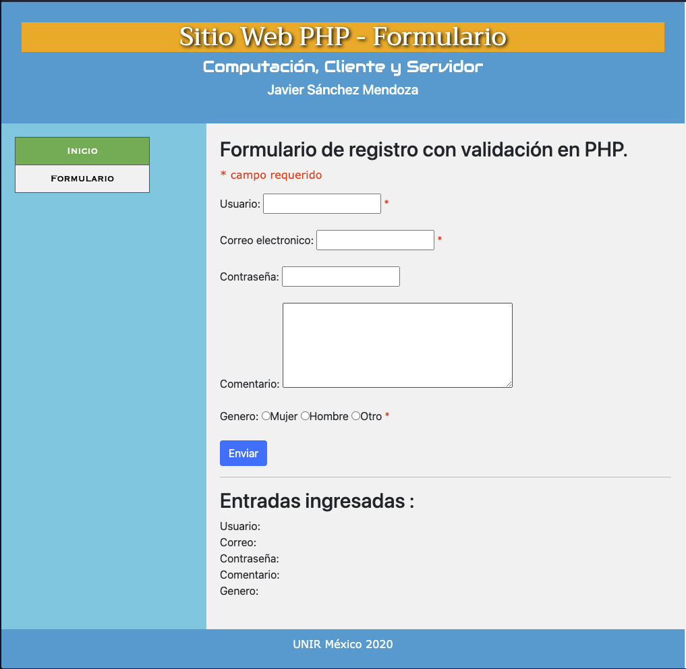

Sitio Web PHP - Formulario

## Bienvenido! 👋

En la pagina el `formulario.html` se carga el codigo html donde se define el formulario que funciona mediante POST y mediante JavaScript se valida el formulario por sentencia de control IF ademas de expresiones regulares, cuando se presiona el botón enviar se valida segun la gramatica de la expreciones regualres.