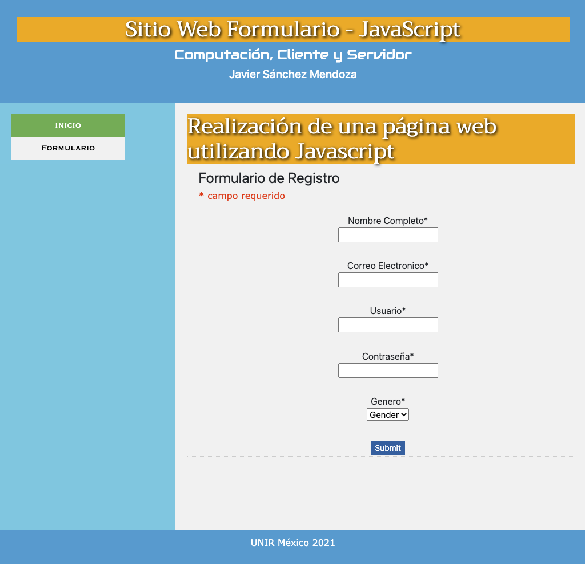

Sitio Web PHP - Formulario

## Bienvenido! 👋 

En la pagina el formulario.php se carga el codigo html donde se define el formulario que funciona mediante POST en la misma pagina se incluye el script de php que validara el formulario mediante sentencias de control y expresiones regulares que cuando se presiona el botón enviar validan lo siguiente:

- Comprueba si el nombre de usuario solo contiene letras 
- Comprueba si la dirección de correo electrónico está bien formada
- Compruebe si la sintaxis de la contraseña es válida 

y actualiza la pagina del formulario para mostrar las validaciones para comprobar si son correctas y al mismo tiempo envía los datos del formulario a la misma pagina en la sección determinada mediante el script display.php